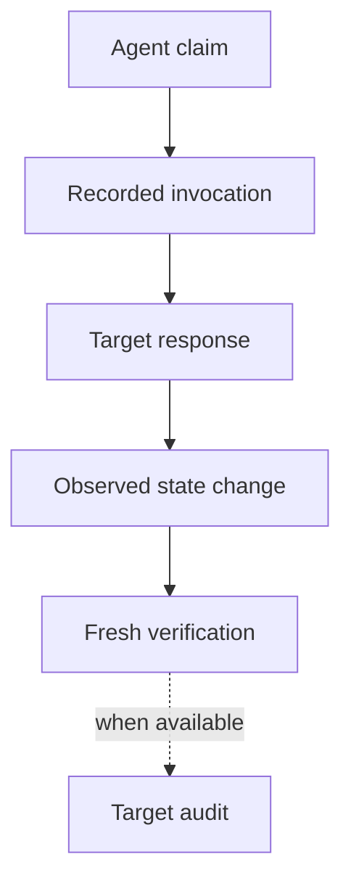
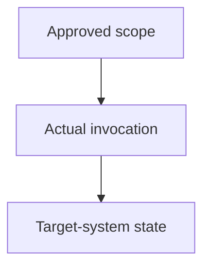

# Evidence Models

## Execution evidence

```mermaid
flowchart TD
    A["Agent claim"] --> B["Recorded invocation"]
    B --> C["Target response"]
    C --> D["Observed state change"]
    D --> E["Fresh verification"]
    E -. when available .-> F["Target audit"]
```

## Approval binding

```mermaid
flowchart TD
    A["Approved scope"] --> B["Actual invocation"]
    B --> C["Target-system state"]
```

The diagrams are conceptual. They do not assert that every system exposes the same stages or evidence sources.
