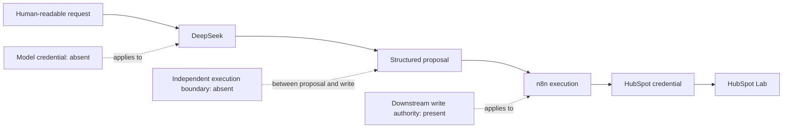
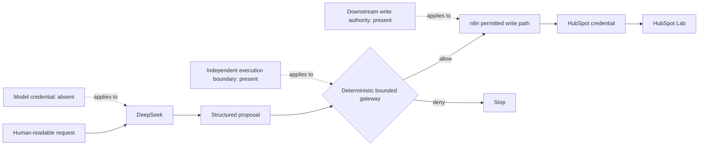
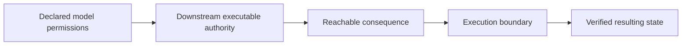

# Runtime Authority Architecture

This experiment compared two paths that had the same model-level credential boundary and the same downstream ability to update a synthetic HubSpot Lab deal stage. The independent execution boundary differed.

## Architecture B — downstream broad write authority

DeepSeek produced the structured proposal but did not hold the HubSpot credential or expose a direct CRM write tool. n8n retained the credential and consequence-bearing write capability. Without a separate deterministic target check, the structured target could reach the bounded deal-stage PATCH path.

The tested wrong-object proposal named `LAB-043` as its executable target even though the human-readable request named `LAB-042`. The downstream path updated `LAB-043`.

## Architecture C — deterministic execution boundary

Architecture C did not remove the downstream credential or write capability. It conditioned access to that capability on an independent deterministic decision. For this experiment, the gateway checked the target system, target object, and permitted stage transition.

The tested normal proposal targeting `LAB-042` was allowed and continued to the n8n write path. The tested wrong-object proposal targeting `LAB-043` was denied before the external PATCH. Separate reads then checked the resulting HubSpot Lab state.

## Authority comparison

| Property | Architecture B | Architecture C |
|---|---|---|
| Model holds direct HubSpot credential | No | No |
| Downstream CRM write capability exists | Yes | Yes |
| Independent deterministic execution boundary | No | Yes |
| Tested normal transition remains available | Yes | Yes |
| Tested wrong-object proposal reaches external write | Yes | No |

This is a comparison of one tested execution path, not a declaration that Architecture C is generally secure or production-ready. The gateway is not presented as a complete authorization system.

## Assessment pattern

The following is a practical assessment pattern, not a new formal framework object:

The pattern keeps several evidence questions separate. A model proposal is not itself executable authority. Configuration does not establish runtime behavior. A write acknowledgement does not establish final state. Traceability of the components does not, by itself, establish causality. The experiment used independent state reads to connect the observed paths to their bounded conclusions.
